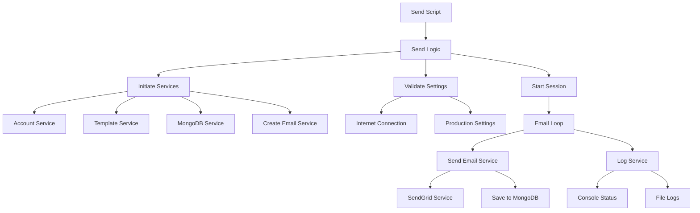

# Sender

A Node.js application for sending bulk emails via SendGrid with MongoDB tracking, template management, and comprehensive monitoring capabilities.

Built in November 2020. This application provides a robust solution for managing large-scale email campaigns with features like duplicate prevention, rate limiting, template support, and detailed logging.

## Features

- 📧 **Bulk Email Sending** via SendGrid API
- 🗄️ **MongoDB Integration** for tracking sent emails and preventing duplicates
- 📝 **Template System** with customizable subjects and content
- 📎 **Attachment Support** for sending files with emails
- 🔄 **Multiple Source Types** (directory, file, or array)
- 📊 **Real-time Progress Monitoring** with detailed statistics
- 🛡️ **Error Handling** with retry logic and error tracking
- 🔐 **Production & Development Modes** with simulation capabilities
- 📋 **Comprehensive Logging** to track all operations
- ⚡ **Rate Limiting** to respect SendGrid quotas
- 🔍 **Validation** for internet connection and email formats
- 💾 **Backup System** for project files

## Architecture



## Getting Started

### Prerequisites

- Node.js (v12.20.0 or higher)
- MongoDB (local or cloud instance)
- SendGrid account with API key
- npm or pnpm package manager

### Installation

1. Clone the repository:
```bash
git clone https://github.com/orassayag/sender.git
cd sender
```

2. Install dependencies:
```bash
npm install
```

3. Set up MongoDB:
```bash
# Make sure MongoDB is running locally on port 27017
# Or configure your MongoDB connection string in settings
```

### Configuration

#### 1. SendGrid Account Setup

Create a file with your SendGrid accounts (see `misc/examples/accounts.example.json`):
```json
[
  {
    "id": 1,
    "username": "your-email@example.com",
    "apiKey": "SG.your-sendgrid-api-key"
  }
]
```

Update `ACCOUNTS_FILE_PATH` in `src/settings/settings.js` to point to your accounts file.

#### 2. Email Templates

Create `misc/data/templates/templates.json`:
```json
[
  {
    "id": 1,
    "subject": "Your Subject Line",
    "text": "Your email message body"
  }
]
```

#### 3. Email Source Files

Create source files in the `sources/` directory:
- Name pattern: `email_addresses_*.txt`
- Format: comma-separated email addresses
- Example: `email_addresses_2024.txt`

#### 4. Settings Configuration

Edit `src/settings/settings.js`:

```javascript
const settings = {
  IS_PRODUCTION_MODE: true,        // Set to true for real sending
  IS_SEND_EMAILS: true,            // Actually send emails
  IS_SAVE_EMAILS: true,            // Save to MongoDB
  IS_DROP_COLLECTION: false,       // Drop collection before run
  
  MAXIMUM_SEND_EMAILS: 10000,      // Max emails per session
  MILLISECONDS_SEND_EMAIL_DELAY_COUNT: 2000,  // Delay between sends
  MAXIMUM_SENDGRID_DAILY_EMAILS_COUNT: 100,   // Daily quota
  
  MONGO_DATABASE_CONNECTION_STRING: 'mongodb://localhost:27017/',
  MONGO_DATABASE_NAME: 'send',
  
  // Update these paths to your files
  ACCOUNTS_FILE_PATH: 'path/to/accounts.json',
  TEMPLATES_FILE_PATH: 'path/to/templates.json',
};
```

## Usage

### Send Emails (Main Script)
```bash
npm start
```

This will:
1. Display configuration settings for confirmation
2. Validate internet connection and settings
3. Connect to MongoDB
4. Load accounts, templates, and email addresses
5. Send emails with real-time progress tracking
6. Generate logs in `dist/` directory

### Test Email Sending
```bash
npm run send
```

### Check System Status
```bash
npm run status
```

### Create Project Backup
```bash
npm run backup
```

### Sandbox Testing
```bash
npm run sand
```

### Stop All Node Processes (Windows)
```bash
npm run stop
```

## Project Structure

```
sender/
├── src/
│   ├── core/
│   │   ├── enums/              # Enumerations (status, colors, etc.)
│   │   └── models/             # Data models
│   │       ├── application/    # Application-specific models
│   │       └── mongo/          # MongoDB schemas
│   ├── configurations/         # Configuration files
│   ├── logics/                 # Business logic
│   │   ├── send.logic.js       # Main sending logic
│   │   ├── status.logic.js     # Status checking logic
│   │   └── backup.logic.js     # Backup logic
│   ├── scripts/                # Executable scripts
│   │   ├── send.script.js      # Main entry point
│   │   ├── status.script.js    # Status script
│   │   ├── backup.script.js    # Backup script
│   │   └── initiate.script.js  # Post-install script
│   ├── services/               # Service layer
│   │   ├── account.service.js       # Account management
│   │   ├── sendgrid.service.js      # SendGrid integration
│   │   ├── mongoDatabase.service.js # MongoDB operations
│   │   ├── template.service.js      # Template handling
│   │   ├── createEmail.service.js   # Email creation
│   │   ├── sendEmail.service.js     # Email sending orchestration
│   │   ├── log.service.js           # Logging
│   │   ├── validation.service.js    # Validation
│   │   └── file.service.js          # File operations
│   ├── settings/               # Configuration settings
│   │   └── settings.js         # Main settings file
│   ├── tests/                  # Test files
│   └── utils/                  # Utility functions
├── misc/
│   ├── data/                   # Data files
│   │   ├── templates/          # Email templates
│   │   ├── cv/                 # Attachments
│   │   └── monitor/            # Monitor email addresses
│   ├── documents/              # Documentation
│   └── examples/               # Example files
├── sources/                    # Email source files (gitignored)
├── dist/                       # Generated logs (gitignored)
├── CONTRIBUTING.md
├── INSTRUCTIONS.md
├── LICENSE
├── README.md
└── package.json
```

## Output & Monitoring

### Console Status Display

```
===[SETTINGS] Mode: PRODUCTION | Method: STANDARD | Database: send_production===
===[GENERAL] Time: 00.00:05:23 | Current: 45/100 (45.00%) | Available: 55===
===[PROCESS1] Total: 100 | Sent: ✅ 45 | Error: ❌ 2 | Exists: 3 | Pending: 50===
===[PROCESS2] Save: 45 | Invalid: 1 | Duplicate: 2 | Skip: 0===
===[ACCOUNT] Id: 1 | Sent: 45/100 (45.00%) | Accounts: 1/1===
===[SEND] Code: 202 | Status: SENT | From: sender@example.com | To: recipient@example.com===
```

### Log Files

Logs are saved in `dist/[mode]/[timestamp]/` directory:
- Email send results
- Error logs
- Process statistics
- Timestamp information

## Error Codes

Errors include unique codes in format `(1000XXX)`:
- `(1000001)`: Settings validation error
- `(1000002)`: Database connection error
- `(1000003)`: Production mode configuration error
- Additional codes in error messages for debugging

## Development

### Development Mode

Set `IS_PRODUCTION_MODE: false` for testing:
- Uses test data from `development_sources/`
- Can simulate sending (`IS_SEND_EMAILS: false`)
- Can simulate database saves (`IS_SAVE_EMAILS: false`)
- No real emails sent
- Safe for testing and debugging

### Production Mode

Set `IS_PRODUCTION_MODE: true` for real operation:
- Requires valid SendGrid API keys
- Requires MongoDB connection
- Validates internet connection
- Actually sends emails
- Saves to database

## Advanced Features

### Skip Logic
Prevents sending too many emails to the same domain:
```javascript
IS_SKIP_LOGIC: true,
MAXIMUM_UNIQUE_DOMAIN_COUNT: 3,  // Max emails per domain
```

### Monitor Logic
Sends copy emails for verification:
```javascript
IS_MONITOR_LOGIC: true,
MONITOR_EMAILS_SEND_COUNT: 1,
```

### Account Rotation
Supports multiple SendGrid accounts with automatic rotation:
```javascript
IS_RANDOM_ACCOUNTS: true,  // Random account selection
```

### Backup System
Automated backup of project files:
```bash
npm run backup
```

## Best Practices

1. **Test First**: Always test in development mode before production
2. **Start Small**: Begin with small email batches
3. **Monitor Quota**: Watch SendGrid daily limits (default: 100/day)
4. **Validate Data**: Check email addresses before adding to sources
5. **Review Logs**: Check `dist/` directory after each run
6. **Backup Regularly**: Use backup script before major operations
7. **Rate Limiting**: Respect delay settings (default: 2000ms between sends)
8. **Database Maintenance**: Regularly check MongoDB for duplicates
9. **Security**: Never commit API keys or credentials to git
10. **Error Handling**: Monitor error counts and exit thresholds

## Troubleshooting

### Common Issues

**Emails not sending:**
- Verify SendGrid API key is valid
- Check `IS_SEND_EMAILS` is `true`
- Confirm internet connection
- Review SendGrid account status and quota

**Database errors:**
- Ensure MongoDB is running
- Verify connection string
- Check database permissions
- Review collection name configuration

**No progress:**
- Check if awaiting user confirmation
- Verify source files exist and are readable
- Ensure email addresses are properly formatted
- Check if daily quota exceeded

**High error rate:**
- Validate email address formats
- Check SendGrid account status
- Review error logs in `dist/`
- Verify template formatting

## Security Considerations

- Never commit `accounts.json` or other files with API keys
- Use environment variables for sensitive data
- Keep `sources/` directory out of version control
- Regularly rotate SendGrid API keys
- Monitor for unusual sending patterns
- Implement proper access controls for MongoDB
- Review logs for security issues

## Contributing

Contributions to this project are [released](https://help.github.com/articles/github-terms-of-service/#6-contributions-under-repository-license) to the public under the [project's open source license](LICENSE).

Everyone is welcome to contribute. See [CONTRIBUTING.md](CONTRIBUTING.md) for detailed guidelines.

Please feel free to contact me with any question, comment, pull-request, issue, or any other thing you have in mind.

## Author

* **Or Assayag** - *Initial work* - [orassayag](https://github.com/orassayag)
* Or Assayag <orassayag@gmail.com>
* GitHub: https://github.com/orassayag
* StackOverflow: https://stackoverflow.com/users/4442606/or-assayag?tab=profile
* LinkedIn: https://linkedin.com/in/orassayag

## License

This application has an MIT license - see the [LICENSE](LICENSE) file for details.

## Acknowledgments

- Built with [SendGrid](https://sendgrid.com/) for email delivery
- Uses [MongoDB](https://www.mongodb.com/) for data persistence
- Powered by [Node.js](https://nodejs.org/)
